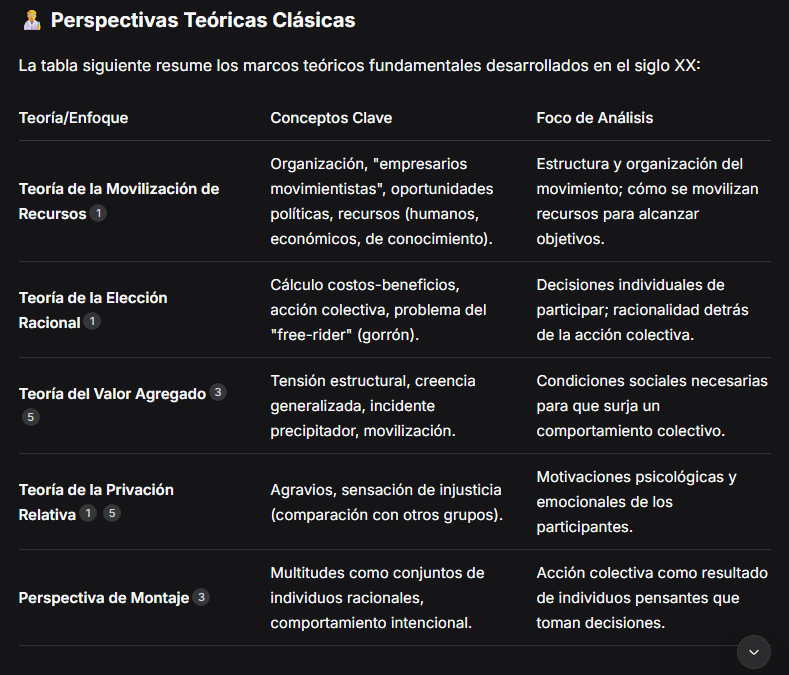

# Pregunta número 1 -Modelo utilizado DeepSeek
## que técnicas o que algoritmos puedo utilizar para crear un modelo de recomendación?
1. Filtrado Colaborativo (Collaborative Filtering)
Se basa en el comportamiento e interacciones de los usuarios (ej.: calificaciones, clics, compras). No requiere información sobre los ítems o usuarios.

Basado en Vecinos (Memory-Based):

Usuario-Usuario: Encuentra usuarios similares y recomienda ítems que les gustaron.

Ítem-Ítem: Recomienda ítems similares a los que el usuario ya interactuó.

Algoritmos clave: Similitud coseno, correlación de Pearson.

Basado en Modelos (Model-Based):

Factorización de Matrices (Matrix Factorization): Descompone la matriz usuario-ítem en factores latentes.

Algoritmos: SVD (Singular Value Decomposition), SVD++, ALS (Alternating Least Squares).

Bayesian Personalized Ranking (BPR): Optimiza el ranking de recomendaciones para datos implícitos.

KNN + Factorización: Combina vecinos más cercanos con modelos de factorización.

2. Métodos Basados en Contenido (Content-Based)
Utilizan características de los ítems (ej.: género, director, texto) y el perfil del usuario.

TF-IDF + Similitud Coseno: Para textos (ej.: descripciones de productos).

Modelos de Clasificación:

Algoritmos: Naive Bayes, Decision Trees, SVM para predecir preferencias.

Embeddings de Texto:

Técnicas: Word2Vec, BERT para representar ítems textuales.

3. Enfoques Híbridos
Combinan filtrado colaborativo y basado en contenido para mitigar limitaciones individuales.

Weighted: Combina puntuaciones de ambos métodos.

Feature Combination: Integra características de contenido en modelos colaborativos.

Ensemble: Usa múltiples modelos (ej.: Random Forest, XGBoost).

4. Métodos con Deep Learning
Ideales para datos complejos (imágenes, texto, secuencias).

Redes Neuronales para Factorización:

NeuMF (Neural Matrix Factorization): Combina factorización y redes neuronales.

Modelos Secuenciales:

RNN/LSTM: Para recomendar basado en historial temporal (ej.: Spotify).

Transformers: Capturan dependencias de largo plazo (ej.: SASRec).

Autoencoders:

Variational Autoencoders (VAE): Generan recomendaciones probabilísticas.

Graph Neural Networks (GNN):

Modelan relaciones usuario-ítem como grafos (ej.: PinSage de Pinterest).

5. Otros Algoritmos Avanzados
Factorization Machines: Capturan interacciones entre características (útil para datos con metadatos).

Context-Aware Recommendations: Incorporan contexto (ubicación, tiempo) con modelos como Tensor Factorization.

Reinforcement Learning: Para recomendaciones adaptativas (ej.: Multi-Armed Bandit).

6. Frameworks y Librerías Populares
Surprise: Python, especializado en filtrado colaborativo.

LightFM: Python, para modelos híbridos.

TensorFlow Recommenders (TFRS): Basado en TensorFlow.

Spark MLlib: ALS para filtrado colaborativo escalable.

FastAI: Incluye modelos de recomendación con deep learning.

Elección del Modelo
Datos con interacciones usuario-ítem: Filtrado colaborativo (SVD, ALS).

Metadatos de ítems: Basado en contenido o híbridos (LightFM).

Datos secuenciales: RNN/Transformers.

Escalabilidad: Matrix Factorization en Spark o TFRS.

Cold Start (usuarios/ítems nuevos): Enfoques híbridos o basados en contenido.

Ejemplo de Flujo de Trabajo
Preprocesamiento: Limpieza, codificación de características.

Selección de Modelo: Según el tipo de datos y objetivo.

Entrenamiento y Evaluación: Métricas como Precision@K, Recall@K, RMSE.

# Pregunta número 2 -Modelo utilzado DeepSeek
## que técnicas y algoritmos se pueden usar para analizar movimientos sociales?

Analizar movimientos sociales combina teorías de las ciencias sociales para entender sus orígenes y dinámicas, con técnicas computacionales para examinar datos generados en plataformas digitales.

