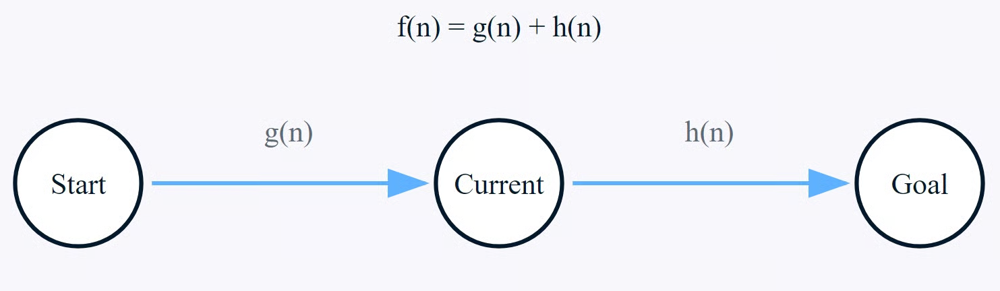

# Algoritmo A*

El algoritmo A* es un algoritmo utilzado para realizar busquedas de caminos mas cortos con obstatuclos de un punto A a un punto B.

## Cómo funciona?
El algoritmo A* es el resultado de los mejores aspectos de otros dos algoritmos.

1. Algoritmo de Dijkstra: Este algoritmo encuentra el camino más corto a todos los nodos desde un único origen.

2. Búsqueda codiciosa del mejor primero: Este algoritmo explora el nodo que parece estar más cerca del objetivo, basandose en una función heurística.

## Componentes clave
* Nodos: Puntos en un gráfico.
* Bordes: Conexiones entre nodos.
* Coste de la ruta: El coste real de pasar de un nodo a otro.
* Heurística: Un coste estimado desde cualquier nodo hasta el objetivo.
* Espacio de búsqueda: La colección de todos los posibles caminos a explorar.

## Conceptos clave de A*
La eficacia del algoritmo A* está dada gracias a la interacción que realizan tres componentes que, en conjunto realizan una evaluacíon inteligente para llevar a cabo el proceso de búsqueda hacia los caminos más prometedores.

### Coste del camino g(n)
Esta función representa la distancia exacta y conocida desde el nodo inicial hasta la posición actual de en nuestra búsqueda. Se calcula sumando el peso de todas las aristas que se han recorrido a lo largo del camino elegido.

Siendo n0(el nodo inicial) y nk(el nodo actual), la función g(n) se puede expresar de la siguiente forma:

Dónde w(ni,ni+1) representa el peso de la arista que conecta el nodo ni al nodo ni+1​.

### Función heurística
La función heurística se encarga de proporcionar un coste estimado desde el nodo actual hasta el nodo objetivo.

Matemáticamente, para cualquier nodo n dado, la estimación heurística debe satisfacer la condición h(n)≤h*(n) donde h*(n) es el coste real del objetivo, lo que lo hace admisible al no sobrestimar nunca el coste real.

En los problemas basados en cuadrículas o en mapas, las funciones heurísticas comunes incluyen la distancia Manhattan y distancia euclidiana. Para las coordenadas (x1,y1) del nodo actual y (x2,y2) del nodo meta, estas distancias se calculan como

#### Distancia Manhattan

#### Distancia euclidiana

### Coste total estimado f(n)
Es la función principal dentro del proceso de toma de desiciones del algoritmo A*, combina el coste real de la ruta como la estimación heurística para evaluar el potencial de cada nodo, Para cualquier nodo n, este coste se calcula de la forma:

Donde:
* g(n) coste real desde el inicio hasta el nodo actual.
* h(n) coste estimado desde el nodo actual hasta el objetivo

A* utiliza estos valores combinados para elegir estrategicamente qué nodo explorar a continuación, seleccionando siempre el nodo con la menor f(n) más bajo de la lista abierta.

## Gestionar listas de nodos
El algoritmo utiliza dos listas esenciales

1. Lista abierta:
    * Contiene nodos que deben evaluarse.
    * Ordenados por valor de f(n).
    * Se añaden nuevos nodos a medida que se descubren.

2. Lista cerrada:
    * Contiene nodos ya evaluados
    * Ayuda a evitar la reevaluación de nodos
    * Se utiliza para reconstruir la trayectoria final.

El algoritmo selecciona continuamente el nodo con el valor más bajo de f(n) más bajo de la lista abierta, lo evalúa y lo mueve a la lista cerrada hasta que llega al nodo meta o determina que no existe ningún camino.

