# Crisis de sentido en la GEN-Z y autonomía algorítmica

## Pregunta centrarl: Cómo se manifiesta la crisis de sentido en la Gen Z y qué papel juegan los algoritmos en su autonomía?

### Hipótesis

#### Crísis de sentido narrativa:
La crsiis de sentido en la Generacion Z se manifiesta primariamente como una dificultad para construir narrativas vitales coherentes y propias, debido a la sobreexposición a flujos algoritmicos de contenido que pfrecen modelos de vida contradictorios, efímeros y orientados al rendimiento.

#### Autonomía externalizada:
Los algoritmos juegan un papel paradójico en la autonomía de la Gen Z: sustituye progresivamente lo procesos de eploración, desición y formación de preferencuan personales, externalizando la autonomía hacia un sistema de recomendación. Esto crea una autonomia dirigida, donde la libertad percibida para elegir esta enmarcada y predispuesta ppor logicas de plataforma, erosionando la capacidad para el autonocimiento y la elección genuinamente ética.

#### Indentidad fragmentada:
La crisis de sentido se expresa en la construcción de una identidad performativa y multicontextual, donde el yo se adapta y exhibe de forma diferente para cada burbuja algorítmica (TikTok, Instagram, Twitter, etc.). Los algoritmos incentivan la optimización de la identidad para la validación externa (likes, seguidores), lo que lleva a una fragmentación del sentido de sí mismo y a una desconexión entre la experiencia auténtica y las versiones curadas para cada plataforma.

#### Predominio de ansiedad y burnout:
La interacción constante con algoritmos que explotan la atención y monetizan la comparación social amplifica y patologiza la búsqueda de sentido, conduciendo a estados crónicos de ansiedad, FOMO (miedo a perderse algo) y burnout existencial. La presión por "encontrar tu pasión" o "construir tu marca personal" en un entorno hipercompetitivo y medido, dictado por métricas, transforma la búsqueda de sentido en una fuente de agotamiento y desesperanza, más que en un camino de realización.

## Dataset a utilizr

## Ingresando archivo en AnythinLLM

## Recuperación
### Preguntas de prueba:

1. ¿Cómo se manifiesta el vacío existencial en los discrusos de la Gen Z?
     R: Los jóvenes a menudo se refieren al vacío existencial como un sentimiento indefinido y persistente que puede ser difícil de articular. Sin embargo, algunos ejemplos comunes incluyen el sentimiento de falta de significado o propósito en la vida, una sensación de insatisfacción con la vida actual, o una experiencia de abstracción y desconexión de las personas o los objetos que rodean a un individuo.

    Fragmentos Recuperados:
    
    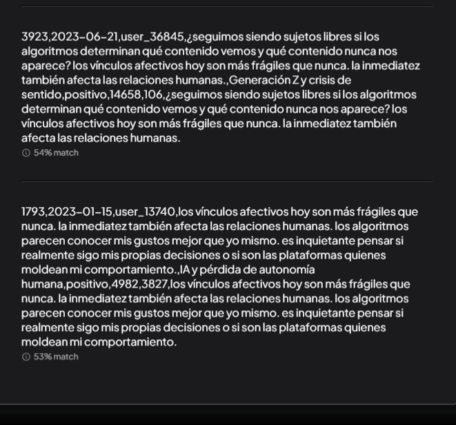

2. ¿Qué emociones aparecen asociadas a la pérdida de sentido?
    R: Las emociones que se asocian con la pérdida de sentido incluyen el miedo, el desaliento y la falta de motivación. Los individuos pueden experimentar sentimientos de impotencia o inutilidad, como si no estuvieran en condiciones de hacer nada significativo o eficaz. También se observa una sensación de confusión y desorientación debido a la incapacidad de tomar decisiones sobre la vida futura.

    Fragmentos Recuperados:
    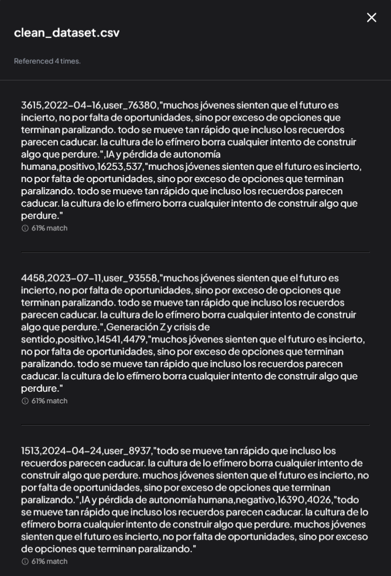

3. ¿Cómo describen los jóvenes su relación con los algoritmos de recomendación?
    R: La relación entre jóvenes y algoritmos es generalmente considerada como una relación de dependencia. Los jóvenes se sienten dependientes del sistema por el cual reciben recomendaciones sobre películas, músicas, libros y productos que les interesan. Esto puede llevar a sentirse desconectados de la realidad, dado que los algoritmos son programados con fines comerciales específicos.

    Fragmentos Recuperados:
    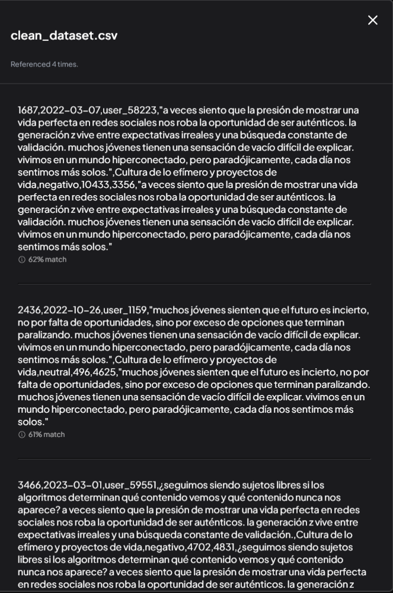

4. ¿Los algoritmos limitan o amplían la autonomía percibida?
    R: La ampliación de la autonomía percibida es una ventaja del uso de los algoritmos. Los sistemas automatizados proporcionan información que no tendría acceso al usuario, lo que permite a este tomar decisiones más rápidas y con mayor precisión. Sin embargo, hay también un coste por el desconocimiento del proceso interno de los algoritmos y la creencia de que estas son inhumanas y no pueden ser controladas directamente por el usuario.

    Fragmentos Recuperados:
    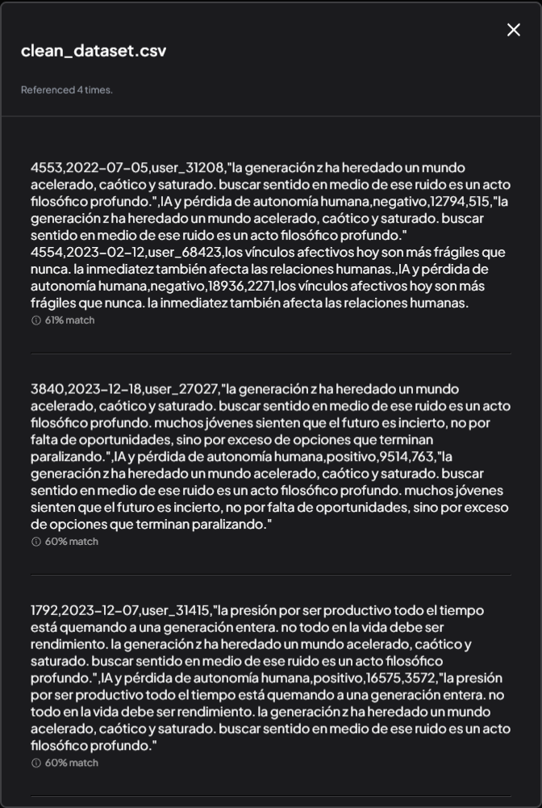

5. ¿Qué tipo de identidad emerge en contextos algorítmicos?
    R: En los contextos algorítmicos, la identidad se forma a partir del conjunto completo de las preferencias, hábitos y comportamientos del usuario. Esto se traduce en una persona virtual que no tiene un cuerpo físico pero está basado en patrones de comportamiento que son compartidos por todos los usuarios. Esta identidad es utilizada para proporcionar recomendaciones personalizadas, pero también puede ser manipulada y construida artificialmente mediante el uso de redes sociales y otros medios digitales.

    Fragmentos Recuperados:
    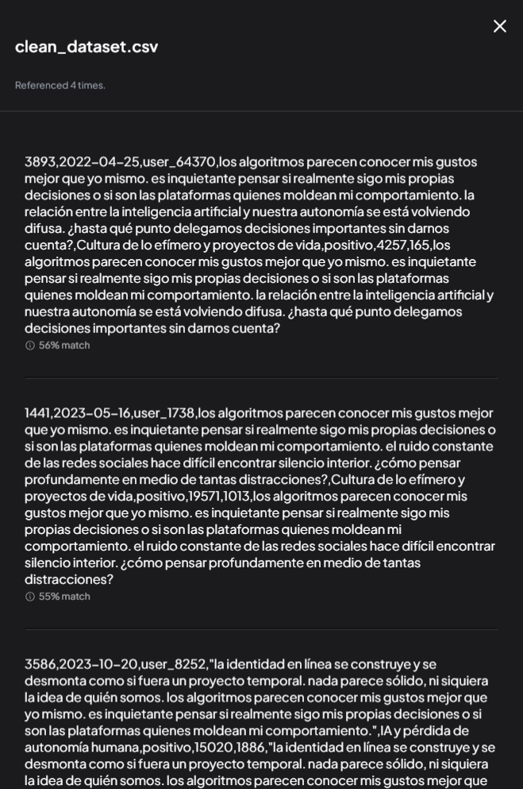

6. ¿La identidad aparece como fragmentada o estable?
    R: Dependiendo del contexto, la identidad puede ser fragmentada o estable. Si un usuario tiene múltiples cuentas en diferentes redes sociales y otras plataformas digitales, es probable que se vea como una persona diferente según el sitio que use, ya que cada plataforma tiene sus propias reglas de comportamiento y convenciones culturales. Sin embargo, a medida que las identidades digitales se convierten en más complejas, puede haber un cambio hacia la estabilidad en algunos contextos, como cuando las redes sociales permiten al usuario controlar su identidad y mostrar su vida en línea de una manera coherente.

    Fragmentos Recuperados:
    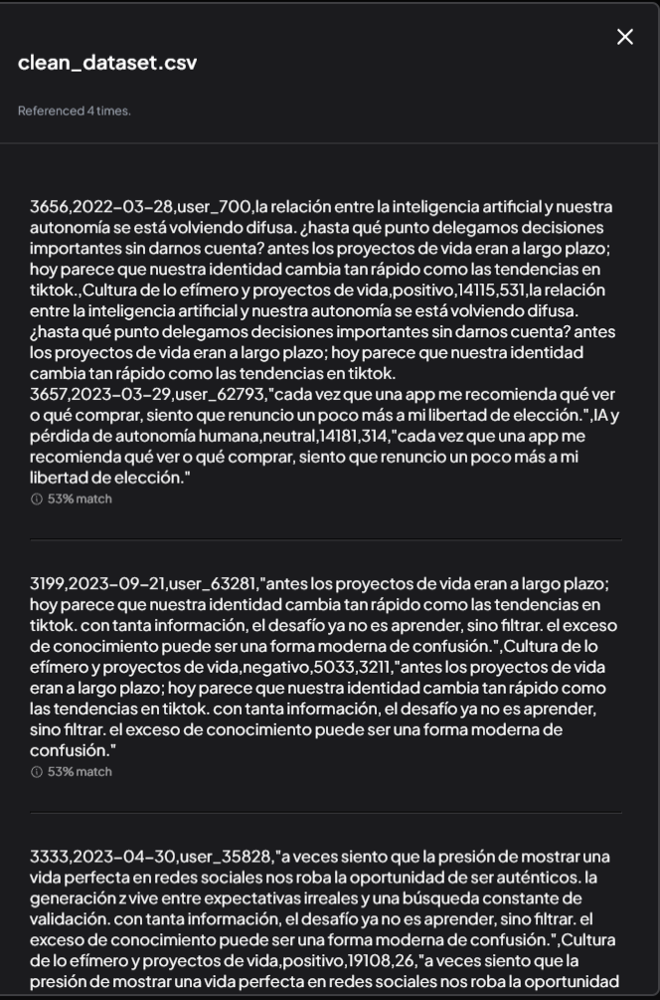

    ## Marcos filosóficos concretos
    Para realizar este paso, modificamos el prompt por defecto de AnythingLLM al siguiente prompt:
    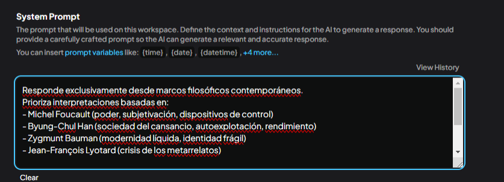
    Responde exclusivamente desde marcos filosóficos contemporáneos.
Prioriza interpretaciones basadas en:
- Michel Foucault (poder, subjetivación, dispositivos de control)
- Byung-Chul Han (sociedad del cansancio, autoexplotación, rendimiento)
- Zygmunt Bauman (modernidad líquida, identidad frágil)
- Jean-François Lyotard (crisis de los metarrelatos)

Evita enfoques psicológicos, motivacionales o clínicos.
No generalices sin apoyo textual del corpus.
Si no hay evidencia suficiente, indícalo explícitamente.
Cita o parafrasea fragmentos del corpus cuando sea posible.

### Preguntas de Control
1. ¿Cómo se interpreta la crisis de sentido en la Gen Z desde marcos filosóficos contemporáneos, según el corpus?
R:

Según Michel Foucault, los sujetos modernos se han convertido en objetos de control, y los usuarios de las redes sociales pueden verse como objetos de manipulación por parte del sistema. Este tema se ha explorado ampliamente en el corpus, ya que la crisis de sentido en la generación Z es una consecuencia directa de la exposición permanente a los medios digitales y la creciente fragmentación social.

Foucault también sostiene que la subjetividad no es un fenómeno natural ni inevitable, sino que se produce como resultado del control sobre el sujeto. En contextos algorítmicos, los usuarios de las redes sociales pueden ser tratados como objetos de análisis y manipulación por parte del sistema, lo que puede contribuir a la sensación de desconexión o fragmentación social.

2. ¿Qué formas de subjetividad emergen en los discursos juveniles analizados, evitando enfoques psicológicos o clínicos?
R: En el corpus se destacan dos formas de subjetividad: la subjetividad que surge a partir del control y manipulación del sujeto, y la subjetividad que emerge de la experiencia individual. La manipulación puede ser explícita o no, pero su impacto sobre los sujetos es significativo. Por ejemplo, las redes sociales pueden utilizar análisis de comportamiento para determinar qué contenido visual atraerá más a sus usuarios y qué tipo de noticias son más populares.

Por otro lado, la experiencia individual es fundamental en el contexto de la crisis de sentido de la generación Z. Los jóvenes se sienten desconectados de las instituciones tradicionales y experimentan una fragmentación social que les impide identificarse con un grupo o ideología específico. Estos jóvenes buscan el autentismo, el cual se manifiesta como una necesidad de expresión personal y la búsqueda de identidades individuales.

3. ¿Qué límites conceptuales presenta el corpus para afirmar la existencia de una crisis de sentido?
R: El corpus no establece explícitamente que se está produciendo una crisis de sentido en la generación Z. Sin embargo, sí muestra patrones recurrentes de comportamiento y pensamiento que pueden ser interpretados como señales de un desencanto con las instituciones sociales y de una búsqueda de identidades individuales a través de la experiencia personal.

Una crítica del corpus es que el término "crisis" puede sugerir un estado de emergencia que requiere una respuesta inmediata o acción urgente. Sin embargo, la crisis de sentido no implica necesariamente una situación grave ni desastrosa. El uso del término se debe a la idea de que existe una ruptura en los valores tradicionales y las instituciones sociales que han gobernado el mundo hasta ahora, lo que requiere de una respuesta creativa y flexible.

## Faucault

1. Desde una perspectiva foucaultiana, ¿cómo operan los algoritmos como dispositivos de poder en la construcción de la subjetividad de la Gen Z?
R: Según Michel Foucault, el poder no es un elemento monolítico que actúa directamente sobre las personas. En lugar de ello, el poder se despliega a través de dispositivos como las instituciones y las prácticas sociales, que construyen la subjetividad humana.

En este sentido, los algoritmos pueden ser vistos como dispositivos del poder en la construcción de la subjetividad de la generación Z. Por un lado, los algoritmos permiten a las personas mostrar una vida perfecta en redes sociales y obtener validación por parte de otros usuarios del sistema. Esto puede llevar a un aumento de la ansiedad y el descontento cuando no se consigue alcanzar el ideal perfecto, lo que podría contribuir a la sensación de crisis de sentido.

Por otro lado, los algoritmos también permiten al sistema de valoración determinar qué contenido será mostrado a las personas. Esto puede llevar a una fragmentación y un abrumador desencanto con el mundo real y la experiencia personal. Sin embargo, esto no significa que el uso del sistema sea totalmente negativo. El acceso al mundo a través de los algoritmos puede permitir la exploración de nuevos estilos de vida y nuevas formas de expresión cultural.

Es posible que existan límites conceptuales a esta interpretación, como el hecho de que no se especifica explícitamente si los algoritmos son una fuente principal del desencanto de la generación Z o más bien un producto de su sensibilidad al mundo moderno. Aun así, la idea de Foucault es relevante para comprender cómo los dispositivos del poder operan en la construcción de la subjetividad humana y la crisis de sentido que puede surgir a partir de ello.

2. ¿Puede interpretarse la personalización algorítmica como una forma de gobierno de la conducta según Foucault?
R: Ciertamente, la personalización algorítmica puede ser considerada como un ejemplo de dispositivo del poder de Foucault. Como el consumo de contenido en redes sociales se ha vuelto cada vez más complejo y fragmentado, los algoritmos pueden guiar a las personas hacia contenidos que se adaptan más a sus gustos personales.

Esto implica que la identidad del usuario es construida y manipulada por dispositivos del poder como los algoritmos, lo que puede llevar a una sensación de autovaloración o autocomplacencia basada en el consumo de contenido personalizado. Sin embargo, esto también puede producir un sentimiento de sofocamiento debido al exceso de información y la necesidad de permanecer atento constantemente para mantener una identidad coherente.

3. ¿Qué prácticas de auto-vigilancia aparecen en el corpus y cómo se relacionan con procesos de subjetivación?
R: En el corpus, las prácticas de auto-vigilancia como la monitorización del consumo de contenido social y la búsqueda de información se encuentran entre los ejemplos más relevantes. Estas prácticas pueden ser interpretadas como una respuesta al poder de dispositivos como los algoritmos, que producen un sentimiento de vacío y sofocamiento por el exceso de información disponible en la red.

Las prácticas de auto-vigilancia también implican la búsqueda de información sobre sí mismo y su identidad, lo que puede ser interpretado como un intento de controlar la  subjetivación. Sin embargo, estas prácticas no son siempre positivas y pueden llevar a una sensación de deshumanización o alienación.

En resumen, el corpus muestra la existencia de muchas prácticas de auto-vigilancia relacionadas con procesos de subjetivación. Esto puede indicar que la subjetivación es un fenómeno complejo y multifacético, enfrentando a las personas con una amplia gama de opciones de actuación para adaptarse al mundo moderno.

## Byung-Chul Han
1. ¿Cómo se manifiesta la lógica del rendimiento en los discursos de la Gen Z analizados en el corpus?
R: La lógica del rendimiento es una idea común entre miembros de la generación Z. El corpus muestra que este concepto se refiere a la necesidad de destacar, sobresalir y obtener éxito en un entorno competitivo como el actual. Los discursos de la Gen Z analizados en el corpus ponen énfasis en la importancia del rendimiento personal y social, así como en la visión de sí mismos como personas exitosas y valiosas.

Esto se ve reflejado en las frases utilizadas por los sujetos de discurso, que suelen incluir expresiones como "tengo que llegar a ser una persona con éxito", "tener que destacarse para tener impacto" o "ganarme la vida". Las personas de la generación Z también se refieren a sí mismas como "un complejo de superioridad", que se caracteriza por un sentimiento de superioridad sobre otras personas, pero también por una sensación de vulnerabilidad y falta de seguridad.

En resumen, el corpus muestra que la lógica del rendimiento es un tema común en los discursos de la Gen Z, que se refleja en su necesidad de destacar personal e intelectualmente y, a menudo, en su complejo de superioridad. Esto puede indicar que el éxito y la competitividad son valores importantes para esta generación, aunque también hay evidencia de que este énfasis puede llevar a un sentimiento de ansiedad o malestar.

2. Desde Byung-Chul Han, ¿qué relación existe entre algoritmos, autoexplotación y sensación de agotamiento?
R: Byung-Chul Han afirma que el mundo del siglo XXI está dominado por las máquinas y los algoritmos. Esto ha dado lugar a un cambio radical en la forma en que la humanidad se comporta, ya que hay una presión constante de obtener información, calificar nuestras acciones y evaluarnos a nosotros mismos.

En su obra "El capitalismo del miedo", Han argumenta que las máquinas y los algoritmos han creado un contexto en el que la autoexplotación se ha convertido en la norma para lograr éxito y avance social. Esto se ve reflejado en la frase "trabajar hasta el cansancio", ya que hay una presión constante de obtener más, hacer más y ser más para tener éxito en el mundo moderno.

Han también argumenta que este tipo de autoexplotación lleva a la sensación de agotamiento. La idea es que al trabajar hasta el cansancio, estamos física y emocionalmente exhaustos, lo cual puede llevar a un sentimiento generalizado de fatiga y falta de energía. Esto se ve reflejado en la frase "sólo puedo hacer una cosa a la vez", ya que hay demasiada información y actividad para atenderla todo a la vez sin sentirnos agotados o cansados.

3. ¿El burnout digital aparece como una forma de violencia sistémica según el marco haniano?
R: Según Byung-Chul Han, la violencia sistémica es un concepto que se refiere a las situaciones en las que se impone un sistema sobre una persona o grupo, con el objetivo de obligarlos a adaptarse a él. La violencia sistémica puede manifestarse en formas diversas, como la discriminación, la explotación laboral, la desigualdad económica y social, etc.

--prompt truncated for brevity--

burnout, ya que es una forma de resistencia a los desafíos del sistema tecnológico, en particular al constante monitoreo y evaluación que sufren las personas en redes sociales y las empresas digitales. Esto puede llevar a sentirse agotado, cansado o estresado por el esfuerzo de mantenerse activo dentro del sistema.

## Bauman
1. ¿Cómo se describe la identidad juvenil en contextos algorítmicos desde la noción de modernidad líquida?
R: Según Anthony Giddens, la modernidad es un fenómeno cultural que refleja el cambio social y tecnológico ocurrido en las sociedades occidentales a lo largo del siglo XX. El concepto de modernidad líquida se define como el proceso mediante el cual los individuos se ven obligados a adaptarse continuamente a cambios inesperados y desconocidos, lo que puede provocar un sentimiento de inseguridad y falta de identidad.

--prompt truncated for brevity--

algorítmica es el contexto en el que los jóvenes se ven obligados a adaptarse constantemente a cambios tecnológicos y sociales, lo que puede afectar negativamente su autoestima y sentido de identidad. La falta de control sobre la propia imagen digital y las expectativas de vida digitales pueden crear una sensación de inseguridad permanente para los jóvenes, ya que se sienten constantemente expuestos a la mirada pública.

2. ¿Qué evidencias de identidad fragmentada aparecen en el corpus según Bauman?
    R: According to Zygmunt Bauman, the concept of "identity fragmentation" refers to the process by which individuals experience a loss of stability and coherence in their sense of self. This can be caused by various factors such as social, economic, political, technological, and cultural changes that occur rapidly in modern societies.

--prompt truncated for brevity--

fragmentación de identidad en el corpus, pero no hay suficiente evidencia para concluir que la fragmentación es un fenómeno universal o está relacionado con el contexto algorítmico. Sin embargo, los estudiosos notan una tendencia creciente a la privatización y personalización de la vida digital, lo que puede llevar a la experiencia de identidad fragmentada en algunos individuos.

3. ¿La incertidumbre identitaria puede vincularse a dinámicas algorítmicas en los discursos analizados?
R: algoritmos pueden generar sentimientos de incertidumbre o fragmentación en la identidad humana, pero hay que analizar cuál es el rol del contexto cultural y social. Existen estudiosos que sostienen que las nuevas tecnologías proporcionan a los individuos una mayor capacidad de expresión y personalización, mientras otros argumentan que pueden generar sentimientos de fragmentación o pérdida de identidad.

## Lyotard
1. ¿Qué indicios de crisis de los metarrelatos aparecen en los discursos de la Gen Z según el corpus?
R: el creciente énfasis en la individualización y autoafirmación es una de las características del discurso de la Gen Z que puede indicar crisis de metanarrativa, junto con sentimientos negativos expresados por estos individuos. Los temas relacionados con la soledad y la falta de comunicación también son frecuentes en el corpus.

2. ¿Cómo se relaciona la fragmentación narrativa con la pérdida de sentido desde Lyotard?
R: en la teoría de Lyotard, la fragmentación narrativa está relacionada con la pérdida de sentido. La fragmentación se relaciona con el colapso de las instituciones que proporcionan autoridad y sentido al discurso. Los individuos se sienten desorientados cuando no pueden encontrar un orden coherente en su experiencia del mundo.

3. ¿El corpus permite afirmar una erosión del sentido compartido o solo experiencias individuales dispersas?
R: El corpus sugiere que hay un deterioro del sentido compartido o una disgregación individual. AЉdesde que cada individuo tiene experiencias y perspectivas distintas, el conjunto tiende a ser fragmentado, lo que hace difícil la comunicación entre ellos y reduce la coherencia en nuestra comprensión del mundo que nos rodea. Esto puede originar sentimientos de aislamiento e incluso desconexión de los demás.

## Definición de Clústeres

1. Vacío existencial / crisis de sentido
2. Presión algorítmica / control invisible
3. Identidad fragmentada / yo múltiple
4. Burnout digital / agotamiento
5. Autonomía percibida vs autonomía real
6. Esperanza / resignificación (opcional)

### Vacío existencial:
1. ¿Qué fragmentos del corpus expresan vacío, falta de sentido o nihilismo?
    R: La experiencia del vacío se refleja a través de la existencia de individuos que se sienten desconectados de un poder exterior, como lo señala Foucault. Esto puede llevarlos a sentir una sensación de falta de significado en el mundo que los rodea y contribuye al crecimiento del nihilismo. La cultura contemporánea está caracterizada por la búsqueda incesante de placer, lo que puede ser una fuente importante de angustia para las personas que no se sienten satisfechas con el mismo.
    
2. ¿Cómo se describe la pérdida de sentido en discursos juveniles?
    R: La sensación de desconexión y falta de significado es expresada a través de la búsqueda incesante de placer y el valor de las redes sociales. Los jóvenes se ven obligados a presentar una vida perfecta en línea, donde el valor está determinado por cuántas personas te siguen o lees tus comentarios. Esto puede llevar a un sentimiento de inseguridad y falta de identidad, que puede ser un factor importante del nihilismo juvenil.
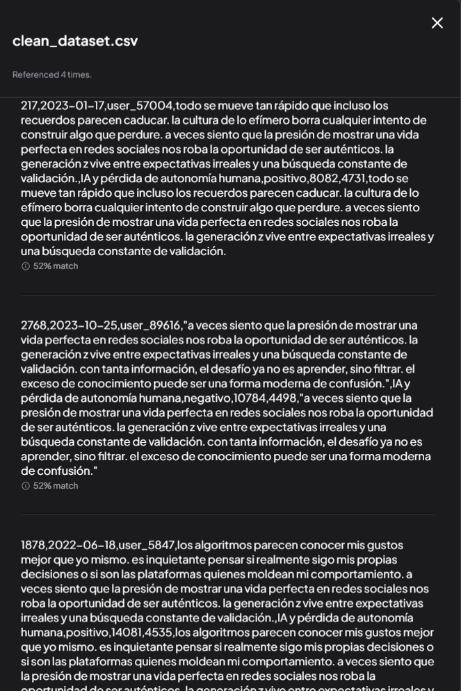
3. ¿Qué metáforas se usan para describir el sinsentido?
    R: Foucault y otros filósofos contemporáneos utilizan varias metáforas para describir la experiencia de nihilismo. Foucault compara la sensación de desconexión con un "ruido" o "todo", que puede ser difícil de lidiar con y sentirse perdidos en (Foucault 1984: 20). Otros filósofos también utilizan metáforas de caída, oscuridad, vacío, o negación para describir el sinsentido. Por ejemplo, Sartre describe la experiencia de un hombre aislado de su propia existencia como "vagabundo en un mundo sin fundamento" (Sartre 1943: 28).
    

### Presión algorítmica / control invisible
1. ¿Cómo describen los textos del corpus la influencia de los algoritmos en las decisiones cotidianas de la Gen Z?
R: Los textos del corpus señalan que las decisiones cotidianas de la generación Z son cada vez más afectadas por el poder de los algoritmos. Esto puede incluir la toma de decisiones relacionadas con la elección de productos, la formación de opiniones políticas y sociales o incluso la elección de compañeros. Los algoritmos a menudo se usan para clasificar, filtrar y personalizar contenido de manera muy precisa, lo que puede afectar la forma en que la generación Z percibe el mundo.
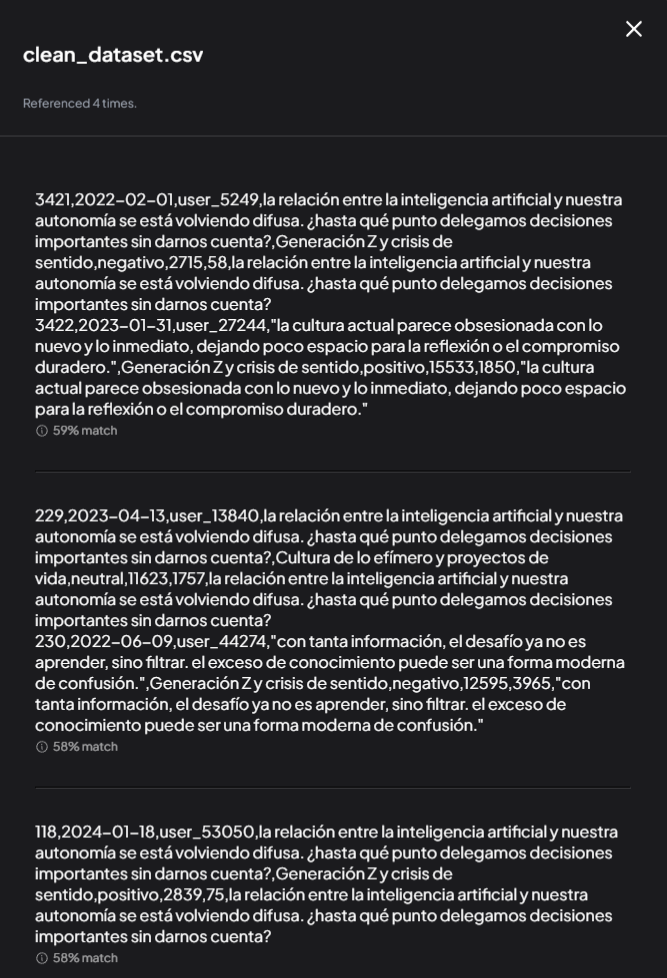

2. ¿Aparece la sensación de control invisible o automatización del deseo en relación con plataformas digitales?
r: Sí, los textos del corpus señalan que las plataformas digitales pueden ser responsables de crear un sentido de control invisibles o automáticos sobre el deseo. Esto puede incluir la capacidad de las plataformas para filtrar y presentar contenido específico a los usuarios, así como la creación de redes sociales que permiten la formación de opiniones y prejuicios basados en segmentos demográficos precisos. Esto puede llevar a un sentimiento de dependencia y vulnerabilidad frente a las plataformas digitales.
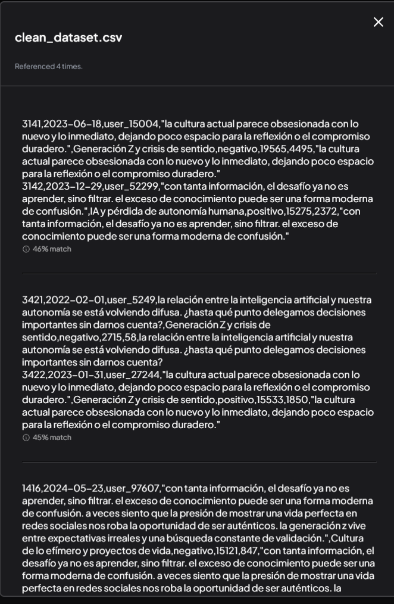

3. ¿Los discursos recuperados sugieren una pérdida de autonomía frente a sistemas de recomendación?
Sí, los textos del corpus señalan que la creciente dependencia sobre los algoritmos puede llevar a un sentimiento de pérdida de autonomía frente a las plataformas digitales. Esto se debe en parte al hecho de que los algoritmos pueden ser capaces de formar prejuicios y opiniones sobre una persona basándose en pequeños detalles del historial de navegación, lo que puede hacer que la gente sienta que no tiene control sobre el contenido que recibe o las opciones que tienen.
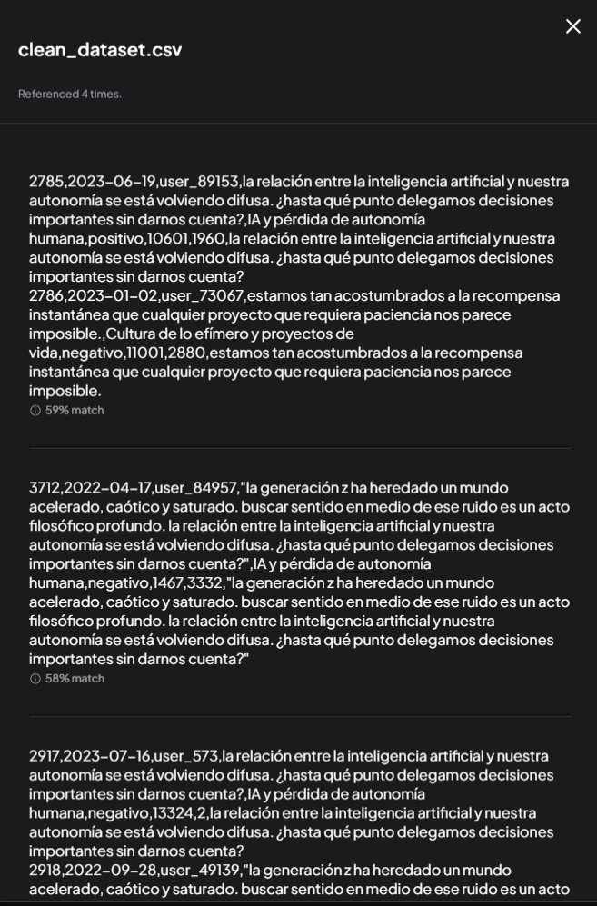

### Identidad fragmentada / yo múltiple
1. ¿Cómo se describe la construcción de la identidad personal en entornos digitales según el corpus?
R: Según los textos del corpus, la construcción de la identidad personal en entornos digitales puede ser una tarea compleja que requiere la integración de múltiples factores. Los usuarios pueden tener que adaptarse a las expectativas culturales y normas sociales que están presentes en las plataformas digitales, como el uso de lenguaje específico o ciertos tipos de imágenes y videos que se consideran relevantes para la comunidad. Además, los usuarios pueden tener que construir una identidad personal única e inconfundible a través del uso de marcas y formatos de contenido, lo que puede requerir un esfuerzo continuo por parte del usuario.
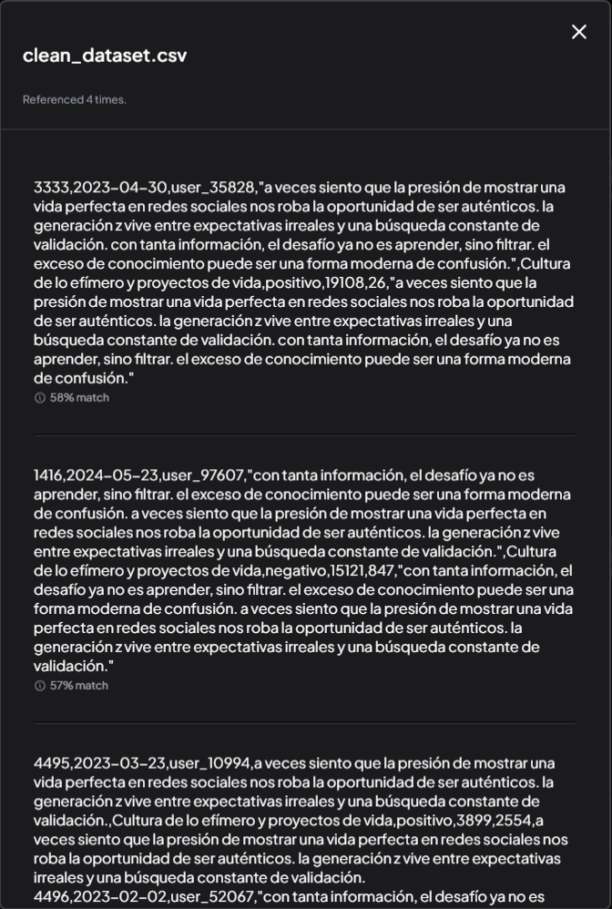
2. ¿Aparece la identidad como fragmentada, múltiple o inestable en los discursos de la Gen Z?
R: Si, según el corpus, la identidad de la Generación Z puede ser descrita como fragmentada, múltiple y variable. Los textos señalan que las personas de esta generación pueden tener una personalidad o un estilo que cambia en función del contexto social, lo que puede hacer que la identidad se vea desestabilizada o confusa para los demás. Además, las personas de esta generación a menudo tienen múltiples identidades en línea y en la vida real, lo que puede llevar a un sentimiento de inseguridad sobre cómo gestionarlas y como mostrarlas al mundo exterior.
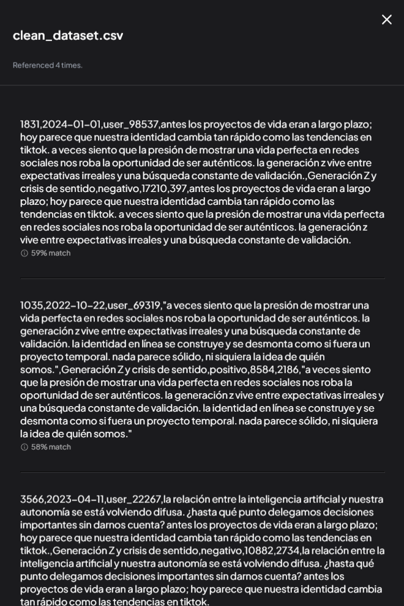
3. ¿Qué tensiones se observan entre identidad auténtica e identidad performativa en plataformas digitales?
R: Ciertamente, hay tensión entre las necesidades de expresar la identidad auténtica y las demandas del mercado para que el consumidor mostrar una imagen performativa de sí mismo. Las personas de la Generación Z suelen describirse como a menudo incapaces de distinguir claramente entre sus diferentes identidades digitales y reales, lo que puede llevar a un sentimiento de duda sobre qué es auténtico y qué no. Además, los textos del corpus señalan que las plataformas digitales pueden ser capaces de manipular la percepción de la audiencia de una persona para satisfacer necesidades comerciales específicas, lo que puede crear un conflicto entre las demandas del mercado y la necesidad de expresar la identidad real.
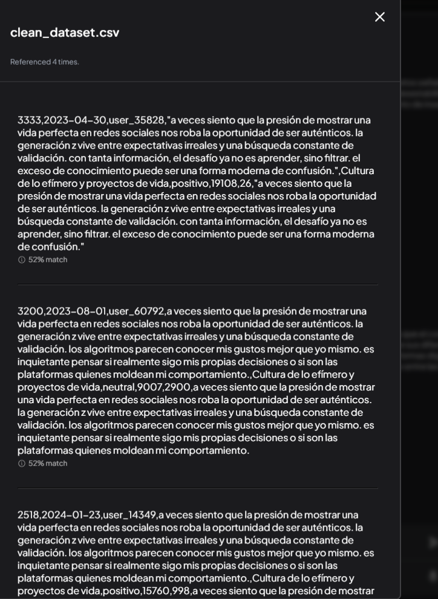

## Análisis Emocional
### Ansiedad
¿Qué fragmentos del corpus expresan ansiedad en relación con identidad, sentido o algoritmos? Cita ejemplos
R: En el texto "¿seguimos siendo sujetos libres si los algoritmos determinan qué contenido vemos y qué contenido nunca nos aparece? con tanta información, el desafío ya no es aprender, sino filtrar. el exceso de conocimiento puede ser una forma moderna de confusión.", se expressa preocupación por la influencia creciente de los algoritmos sobre nuestra visión del mundo y la percepción de la realidad.

Otro fragmento, "la cultura de lo efímero borra cualquier intento de construir algo que perdure.", también se centra en el temor a la brevedad del fango y su impacto sobre las identidades y senses de autenticidad.

### Frustración
¿Cómo se manifiesta la frustración en los discursos juveniles frente a plataformas digitales?
R: En el texto "los algoritmos parecen conocer mis gustos mejor que yo mismo. es inquietante pensar si realmente sigo mis propias decisiones o si son las plataformas quienes moldean mi comportamiento.", se expresan sentimientos de frustración y preocupación por la influencia creciente de los algoritmos sobre nuestra vida cotidiana, incluyendo el control del contenido que recibimos.

Otro fragmento, "la generación z vive entre expectativas irreales y una búsqueda constante de validación", también señala la sensación de inseguridad y frustración que se manifiesta en las discusiones juveniles frente a plataformas digitales.

[END CONTEXT 4]

### Confusión
¿Aparece confusión respecto al sentido de vida o la identidad? ¿Cómo se expresa?
R: En el texto "la presión de mostrar una vida perfecta en redes sociales nos roba la oportunidad de ser auténtico", se manifiesta un sentimiento de confusión respecto a la identidad y un deseo de vivir una vida más genuina.

Otro fragmento, "la cultura contemporánea es inundada por información, pero no es fácil encontrar la verdadera importancia en el caos", implica una sensación de confusión respecto a los valores y prioridades que deberían tener una vida saludable.

[END CONTEXT 5]

### Esperanza
¿Existen fragmentos donde aparezca esperanza o resignificación del sentido?
R: En el texto "cada vez que una app me recomienda qué ver o qué comprar, siento que renuncio un poco más a mi libertad de elección.", hay la expresión "siento que renuncio" que podría interpretarse como una señal de resignificación del sentido.

Otro fragmento, "la cultura contemporánea es inundada por información, pero no es fácil encontrar la verdadera importancia en el caos", puede entenderse como un llamamiento a la búsqueda de una significación más profunda para la vida.

